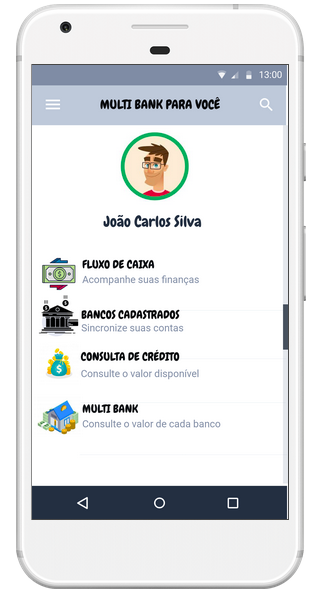

# Equipe 21: Multi Bank

Repositório com o intuito de apresentar um protótipo do aplicativo multi-bank, proposto no Hackthon da TecBan 2020. O objetivo principal desse aplicativo é reunir em um só lugar funcionalidades para ajudar os micro e pequenos empresários. Nossas soluções:
<ul>
  <li>Empréstimo Multi Bank</li>
  <li>Análise de Movimentações Bancárias</li>
  <li>Fluxo de Caixa</li>
</ul>

Esta é o menu do aplicativo.
 

 

Aqui temos o link para visualizar o app web: http://andrevinicius123.scienceontheweb.net/hackathontecban/

## Sobre o Projeto

Desenvolvido para apresentar no Hackathon da TecBan 2020.
 
Equipe B.E.M. - Boleia em Movimento:
<ul>
  <li><a href='https://www.linkedin.com/in/andre-vinicius-mendes-barros-800410195/'> André Vinícius</a></li>
  <li><a href='https://www.linkedin.com/in/giovany-nogueira-51a12268/'> Giovany Nogueira</a></li>
  <li><a href='https://www.linkedin.com/in/melodyrodrigues//'> Melody Rodrigues</a></li>
</ul>
